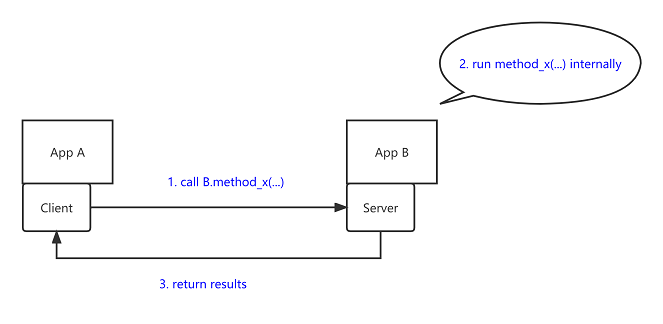
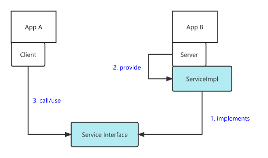

# Java RPC Frameworks

This project is to implement and compare several common Java RPC frameworks.

- Java RMI (TODO)
- Hessian
- Dubbo (TODO)
- MORE...

Comparison:

| Type     | Serialization/Deserialization        | Data Transfer Protocol |
|----------|--------------------------------------|------------------------|
| Java RMI | Java Serialization                   | HTTP                   |
| Hessian  | Hessian Serialization                | HTTP                   | 
| Dubbo    | Configurable - Hessian Serialization | TCP                    |

## How RPC works

## How RPC implements

## User Story

### Functionality

As a user of App A, I want to get the key-value mapping of some stock's price by querying App B's API.

example:

- A's input: apple
- B's output: 150

### API

- url: `/get_stock_price`
- method signature: `double getStockPrice(String stockName)`

## Hessian

### Run Instruction

- import as maven project
- run `HessianServer.java`
- run `HessianClient.java`

### Sample Output

Server

~~~
INFO 12372 --- [           main] o.example.hessian.server.HessianServer   : Started HessianServer in 0.726 seconds (JVM running for 1.323)
INFO 12372 --- [nio-8080-exec-1] o.a.c.c.C.[Tomcat].[localhost].[/]       : Initializing Spring DispatcherServlet 'dispatcherServlet'
INFO 12372 --- [nio-8080-exec-1] o.s.web.servlet.DispatcherServlet        : Initializing Servlet 'dispatcherServlet'
INFO 12372 --- [nio-8080-exec-1] o.s.web.servlet.DispatcherServlet        : Completed initialization in 0 ms
~~~

Client

~~~
=== start ===
apple: 150.0
taobao: -1.0
=== end ===
~~~

### Reference

- http://hessian.caucho.com
- https://www.baeldung.com/spring-remoting-hessian-burlap

## Reference

- https://zhuanlan.zhihu.com/p/46818259